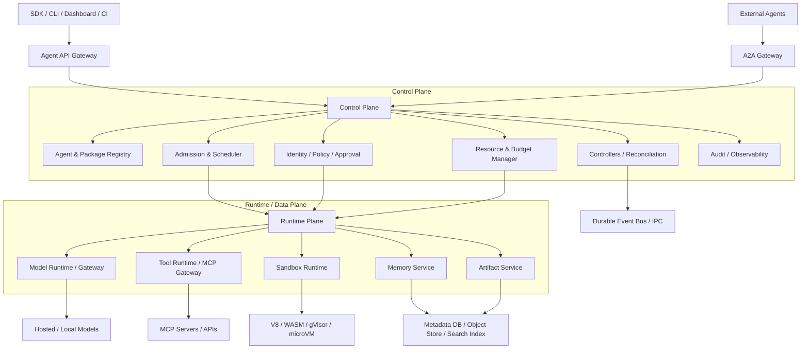
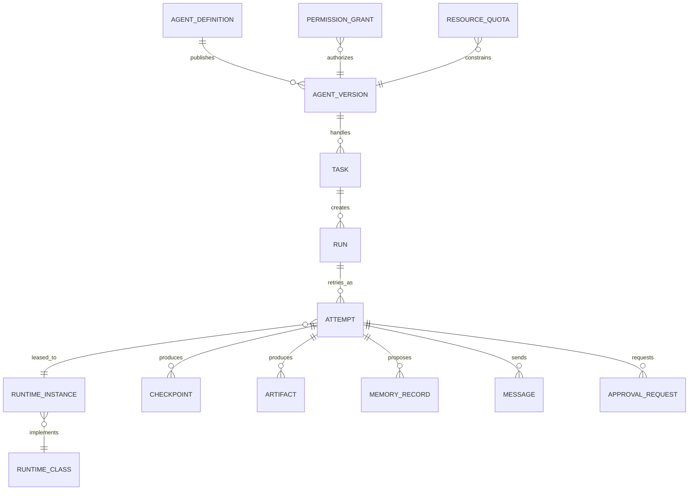
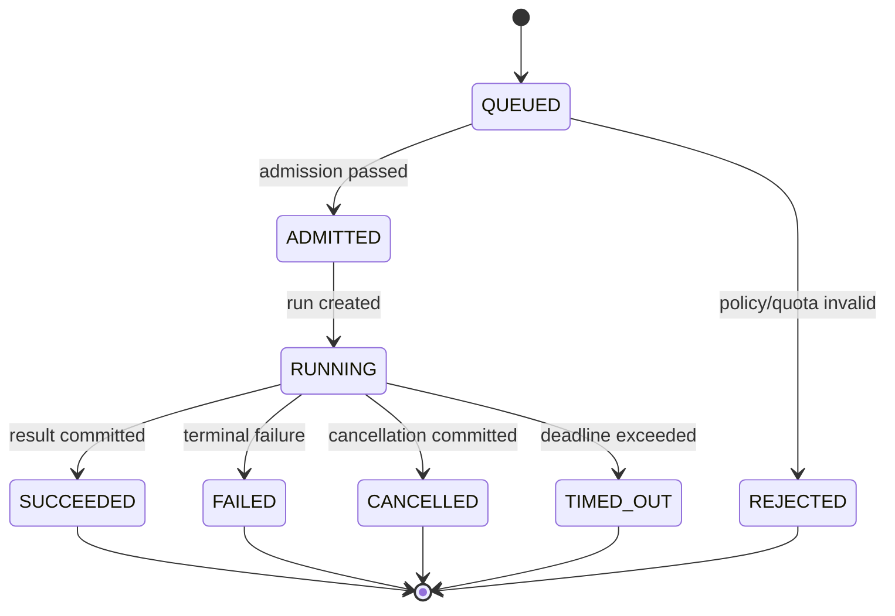
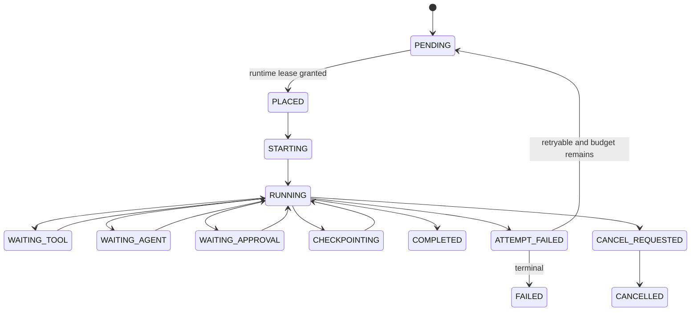
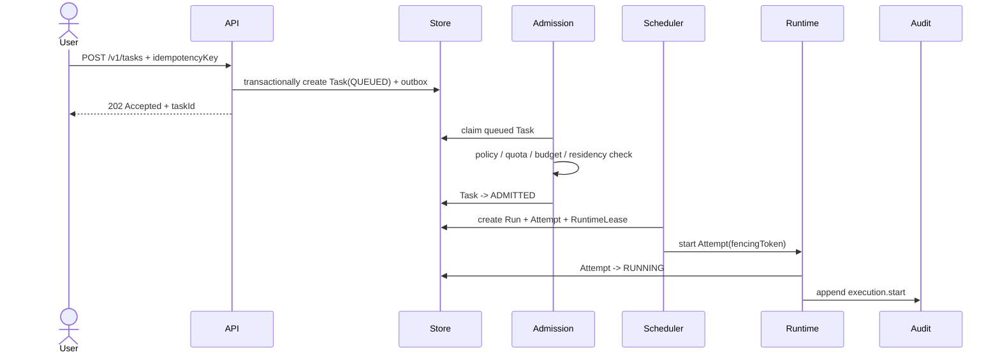
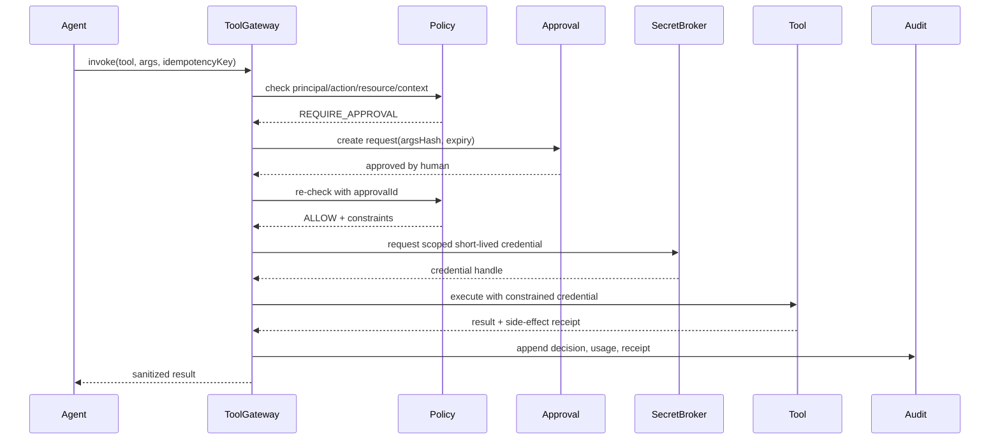
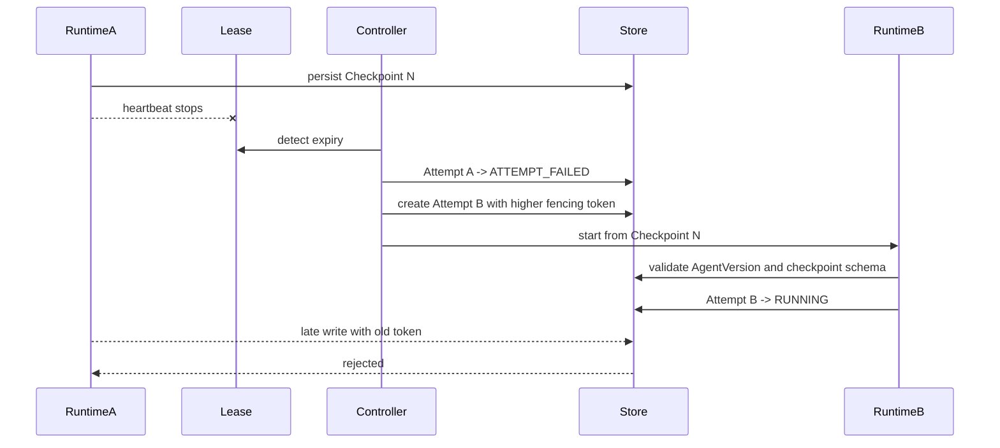
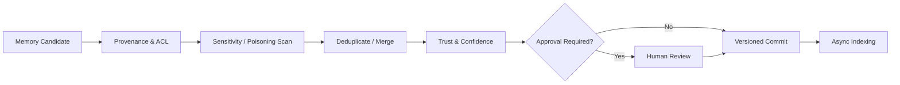
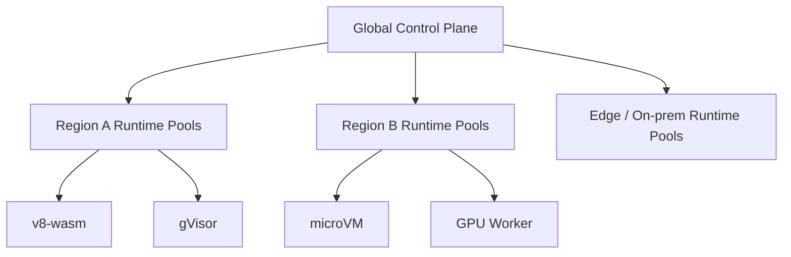

# Agent OS 完整架构设计

> 文档状态：架构基线草案  
> 版本：v0.2  
> 更新日期：2026-08-13  
> 目标读者：架构师、Kernel/Runtime 工程师、安全工程师、平台工程师与技术决策者  
> 文档目标：定义 Agent OS v1 的长期系统边界，并给出可按 v0.x 逐步实现的工程基线。  
> 说明：本目录下的 `Agent OS 完整架构设计研究报告.pdf` 是本文件的渲染副本，
> 两者可能不同步；以本 Markdown 文件为唯一真源。

---

## 1. 执行摘要

Agent 基础设施正在自然分层：Agent Framework 负责编写 Agent，Durable Runtime 负责持久化执行，Sandbox 负责隔离，Control Plane 负责运营管理，MCP 负责 Agent 与工具/上下文集成，A2A 负责独立 Agent 系统之间的互操作。

仍然缺少一个稳定的系统软件层，将这些能力组织成统一的对象模型、生命周期、权限边界、资源模型和兼容接口。

本项目将 Agent OS 定义为：

> **异构 AI Agent 的系统软件层：统一管理 Agent 的身份、版本、任务、执行、模型、工具、记忆、权限、隔离、资源、预算和跨 Agent 通信。**

它不等于多 Agent 编排框架，也不等于 Agent 管理后台。Agent 可以使用不同语言、模型、框架和运行环境；Kernel 只管理稳定的系统对象及其状态。

长期稳定的核心对象包括：

- `AgentDefinition` 与 `AgentVersion`
- `Task`
- `Run` 与 `Attempt`
- `RuntimeClass` 与 `RuntimeInstance`
- `PermissionGrant` 与 `ApprovalRequest`
- `ResourceQuota` 与 `Budget`
- `Tool`、`MemoryRecord` 与 `Artifact`
- `Message`、`Checkpoint` 与 `AuditEvent`

整体分为五层：

```text
Developer Platform
        ↓
Agent API / Control Plane
        ↓
Agent Kernel
        ↓
Runtime / Sandbox / Memory / Tool
        ↓
Models / CPU / GPU / Storage / Network / External Systems
```

项目真正的长期壁垒不是再实现一种 Agent Loop，而是建立 Agent 世界的系统抽象、接口规范和一致性测试体系，使不同 Agent Framework 都能运行在同一系统之上。

## 2. 范围与非目标

### 2.1 v1 范围

Agent OS v1 负责：

1. Agent 声明、版本与发布管理。
2. Task、Run、Attempt 的持久化生命周期。
3. Admission Control、Placement 与资源调度。
4. 模型、Token、成本、工具 QPS 和人工审批容量的统一预算。
5. 默认拒绝的权限系统、Secret Broker 和分级运行时隔离。
6. Durable IPC、事件、Checkpoint、重试和取消。
7. Memory 与 Artifact 的权限、来源、版本、保留和删除。
8. MCP、A2A、HTTP/Webhook 等外部协议适配。
9. 多租户、审计、可观测性、升级、回滚和兼容性验证。
10. SDK、CLI、本地模拟器、调试器、Registry 与 Conformance Test Kit。

### 2.2 非目标

v1 不负责：

- 规定 Agent 必须采用哪种推理范式或 Prompt 模板。
- 绑定某一家模型、云平台、向量数据库或 Sandbox Provider。
- 用一个协议替代 MCP、A2A 和内部 Runtime Protocol。
- 承诺跨任意外部系统的真正 exactly-once side effect。
- 将 Prompt 中的安全指令当成权限执行机制。
- 在 Kernel 内实现所有 Agent Framework 已经成熟的编排能力。

## 3. 设计原则

1. **Kernel 不理解业务 Agent。** Kernel 只理解身份、任务、执行、权限、资源、预算、状态、消息和生命周期。
2. **Model 不是 Agent。** Agent 身份与模型解耦，模型升级不改变 Agent 身份。
3. **Task 与执行分离。** Task 表达目标；Run 表达一次逻辑执行；Attempt 表达一次具体运行尝试。
4. **声明式优先。** 用户提交 desired state，Controller 通过 reconciliation 收敛 actual state。
5. **控制面与数据面分离。** 控制面管理状态和策略，数据面执行模型、工具、代码和检索。
6. **默认拒绝。** 所有权限由 Kernel/Runtime 强制执行，不依赖 LLM 自律。
7. **持久化优先。** Task、状态变更、消息和副作用意图必须可追踪、可恢复。
8. **预算是一等资源。** Token、金额、工具调用、网络、存储和人工审批均可计量和强制限制。
9. **Source of Truth 与索引分离。** Vector、Keyword、Graph 都是派生索引，不是真源。
10. **Adapter 优先。** 成熟框架和运行时应作为 Provider 接入，而不是全部重写。
11. **Architecture first, implementation incremental.** v0.1 实现范围小，但对象模型和边界与 v1 一致。
12. **先定义系统不变量，再实现功能。** 可恢复性、安全性和兼容性必须能够被自动测试。

## 4. 总体架构



### 4.1 Control Plane

Control Plane 负责：

- Agent 与 Package 的声明、版本和发布。
- Task 接收、校验和状态查询。
- Reconciliation、Admission、Placement 和调度。
- Identity、Policy、Approval、Quota 与 Secret Broker。
- Runtime Pool、Deployment、升级与回滚。
- Audit、Trace、Metric、Usage 和 Cost Attribution。

Control Plane 应尽量无状态；需要持久化的状态写入元数据数据库、事件日志、对象存储和 Secret Store。

### 4.2 Runtime/Data Plane

Runtime/Data Plane 负责：

- 实际执行 Agent workload。
- 调用模型、工具、浏览器和代码运行环境。
- 强制实施网络、文件、进程、环境变量和凭证权限。
- 采集 Token、成本、QPS、CPU、内存、GPU、网络和存储用量。
- 生成 Checkpoint、Artifact、Memory Candidate 和执行事件。

## 5. 核心对象模型

### 5.1 对象定义

| 对象 | 职责 | 关键系统性质 |
|---|---|---|
| `AgentDefinition` | Agent 的稳定身份与逻辑名称 | 唯一身份、与模型解耦 |
| `AgentVersion` | 不可变的可部署 Agent 规格 | 不可变、可签名、可回滚 |
| `Task` | 用户或系统希望完成的目标 | 持久、可取消、有预算 |
| `Run` | Task 的一次逻辑执行 | 可恢复、可重放、状态受 Kernel 管理 |
| `Attempt` | Run 的一次具体运行尝试 | 绑定 Runtime Lease、记录失败原因 |
| `RuntimeClass` | 执行环境与隔离等级的声明 | 可插拔、策略可选择 |
| `RuntimeInstance` | 某个实际运行实例 | 有租约、心跳和资源计量 |
| `Tool` | 外部能力的类型化声明 | 权限控制、副作用分类、版本化 |
| `MemoryRecord` | 可长期读取或写入的信息 | Provenance、ACL、版本、保留策略 |
| `Artifact` | 文件、代码、报告、截图等大对象 | 内容寻址、不可变版本、ACL |
| `PermissionGrant` | Principal 对 Resource 的 Action 授权 | 默认拒绝、可撤销、可审计 |
| `ApprovalRequest` | 高风险动作的人类授权请求 | 与具体参数和 Attempt 绑定 |
| `ResourceQuota` | 租户或 Agent 可消费的资源上限 | 可计量、可预留、可强制终止 |
| `Message` | Agent/Task/Run/Runtime 间的持久消息 | 至少一次、幂等、可追踪 |
| `Checkpoint` | 可恢复执行状态 | 版本化、完整性校验、兼容性声明 |
| `AuditEvent` | 安全与资源决策记录 | Append-only、防篡改、可查询 |

### 5.2 对象关系



### 5.3 为什么必须拆分 Task、Run 与 Attempt

- Task 是用户意图，例如“生成竞品研究报告”。
- Run 是完成该 Task 的一次逻辑执行，可以从 Checkpoint 恢复。
- Attempt 是具体分配到某个 RuntimeInstance 的一次尝试；Runtime 崩溃后创建新 Attempt，但仍属于同一个 Run。

如果三者合并，重试次数、运行位置、Checkpoint、用量、取消和副作用状态会互相污染，也无法准确区分“任务失败”和“本次机器尝试失败”。

## 6. 系统不变量

以下不变量必须通过数据库约束、事务、Policy、Runtime Enforcement 和 Conformance Test 共同保证：

1. `AgentVersion.spec` 发布后不可修改；升级必须创建新版本。
2. Task、Run、Attempt 的 `status` 只能由 Kernel Controller 写入。
3. 一个 Run 同一时刻最多存在一个持有有效执行租约的 Attempt。
4. 一个 Runtime Lease 必须包含 fencing token；旧租约持有者不能继续提交状态。
5. 状态转移必须满足乐观并发版本检查，禁止无条件覆盖。
6. 任何高风险副作用必须绑定 `taskId + runId + attemptId + idempotencyKey`。
7. 消息传递只承诺 at-least-once；消费者必须幂等。
8. Permission、Quota、Approval 必须在副作用发生前完成 Kernel-level 校验。
9. Approval 必须绑定规范化后的工具名、参数摘要、目标资源和过期时间，不能被其他调用复用。
10. Secret 不进入 Prompt、Memory、Transcript、Agent 文件系统或普通日志。
11. 所有 Tool、Memory 和 Artifact 访问必须先经过 ACL/Policy 过滤。
12. Token、金额或其他硬预算耗尽后，Runtime 必须在有界时间内停止继续消费。
13. Checkpoint 必须标注 AgentVersion、Runtime ABI、Schema Version 和内容校验值。
14. 长期 Memory 必须具有来源、所有者、租户、可信度、敏感级别和保留策略。
15. 删除 Memory 的请求必须传播到真源、派生索引、缓存和备份生命周期。
16. AuditEvent 不允许业务服务原地修改或删除。
17. 用户可见的 SUCCEEDED 只能在结果与必要副作用完成持久化后产生。

## 7. 声明式数据模型

### 7.1 AgentVersion 示例

```yaml
apiVersion: agentos.dev/v1alpha1
kind: AgentVersion
metadata:
  name: research-agent
  namespace: acme/research
  version: "1.3.0"
  labels:
    team: research
spec:
  runtimeClassPolicy:
    allowed: [v8-wasm, container-gvisor]
    preferred: container-gvisor
  capabilities:
    - research
    - artifact.read
  modelPolicy:
    route: quality-cost-router
    allow:
      - provider-a/model-x
      - local/model-y
  tools:
    - ref: mcp://github
      version: ">=2.0 <3.0"
    - ref: mcp://browser
  memory:
    workingMaxTokens: 32000
    longTerm:
      enabled: true
      retentionDays: 365
  permissions:
    grants:
      - resource: "tool:github/repos/*"
        actions: [read]
  resources:
    requests:
      cpu: "1"
      memory: 2Gi
    limits:
      cpu: "2"
      memory: 4Gi
      concurrency: 2
      tokenPerTask: 200000
      costUsdPerDay: 50
  networkEgress:
    allow:
      - api.github.com:443
  lifecycle:
    restartPolicy: on-failure
    maxAttempts: 3
    checkpointInterval: 30s
```

### 7.2 Task 示例

```yaml
apiVersion: agentos.dev/v1alpha1
kind: Task
metadata:
  id: task_01J...
  namespace: acme/research
spec:
  agentRef: research-agent@1.3.0
  goal: 调研竞争对手并形成技术报告
  inputs:
    artifacts:
      - artifact://brief.pdf
  priority: 70
  deadline: "2026-09-01T18:00:00Z"
  budget:
    tokens: 200000
    costUsd: 20
    toolCalls: 500
    wallTime: 2h
  approvalPolicy:
    requireWhen:
      - "sideEffectRisk == 'high'"
  retryPolicy:
    maxAttempts: 3
    backoff: exponential
  idempotencyKey: research-acme-001
status:
  phase: QUEUED
  activeRunId: null
  resultRef: null
  usage:
    tokens: 0
    costUsd: 0
```

`Run` 与 `Attempt` 由 Kernel 创建，用户不能伪造运行状态或资源用量。

## 8. 生命周期与状态机

### 8.1 Task 状态机



### 8.2 Run 与 Attempt 状态机



### 8.3 状态写入规则

- API 只写入 intent，例如 `cancelRequestedAt`；Controller 负责完成状态转移。
- 状态更新携带 `resourceVersion`，并使用 compare-and-swap。
- Controller 必须幂等；重复处理同一个事件不得产生第二次副作用。
- 长操作通过 lease + heartbeat 维持所有权。
- 租约转移必须增加 fencing token，拒绝旧 Attempt 的迟到写入。

## 9. 关键执行时序

### 9.1 Task 提交与调度



### 9.2 高风险工具调用



### 9.3 Runtime 崩溃与恢复



## 10. Kernel 组件设计

### 10.1 Reconciliation Controllers

每种核心对象都有独立 Controller，将 desired state 收敛为 actual state。Controller 通过持久化 work queue 处理事件，并定期全量 resync，避免事件丢失导致永久漂移。

Controller 必须：

- 幂等。
- 支持并发版本检查。
- 使用租约或 leader election 避免双主。
- 对短暂错误退避重试。
- 对永久错误写入明确的 Condition 与原因码。
- 不依赖仅存在于内存中的关键状态。

### 10.2 Admission Control

Admission 在调度前依次执行：

1. Schema 与版本兼容检查。
2. 身份、签名与供应链检查。
3. Permission 与 Policy 检查。
4. Tenant Quota 和 Task Budget 预留。
5. RuntimeClass、模型、GPU 和工具可用性检查。
6. 数据驻留、网络出口与敏感级别检查。
7. Deadline、优先级和最大执行时间检查。

Admission 结果必须包含可机读 reason code，不能只有自然语言错误。

### 10.3 Scheduler

Scheduler 分为两阶段：

```text
Admission Control
        ↓
Placement / Scheduling
```

Placement 的输入包括：

- Priority、Deadline 与 Fair-share。
- CPU、RAM、GPU 和本地模型容量。
- LLM concurrency、Token throughput 与供应商 rate limit。
- Tool QPS、网络出口和存储。
- 预计成本、数据地域和 Artifact locality。
- RuntimeClass、风险等级与租户隔离要求。
- 人工审批队列容量。

建议 v0.1 使用可解释的分层打分策略，不在早期引入不可解释的学习型调度器。

### 10.4 Resource 与 Budget Manager

资源分为三类：

| 类型 | 示例 | 控制方式 |
|---|---|---|
| 物理资源 | CPU、RAM、GPU、存储、网络 | request/limit、cgroup、Runtime Provider |
| AI 资源 | Token、模型并发、上下文长度、工具 QPS | 预留、计量、速率限制 |
| 业务资源 | 金额、人工审批、外部 API 配额 | Budget ledger、队列、熔断 |

Budget Manager 使用 reservation + settlement：执行前预留上限，执行中持续结算，完成后释放余额。对于无法准确预估的模型流式调用，Gateway 必须基于增量用量进行硬停止。

## 11. Runtime 与隔离

### 11.1 RuntimeClass

| RuntimeClass | 典型场景 | 隔离强度 | 主要限制 |
|---|---|---:|---|
| `trusted-process` | 内部可信、低风险 Agent | 低 | 不运行未知代码 |
| `v8-wasm` | JS Agent、轻量 Tool | 中 | POSIX/原生二进制兼容有限 |
| `container-gvisor` | 普通不可信代码 | 高 | 启动和系统调用有额外开销 |
| `microvm` | Coding、Browser、未知二进制 | 很高 | 成本与冷启动更高 |
| `gpu-worker` | 本地模型与 GPU Tool | 专用资源 | 需额外防止跨租户数据残留 |

RuntimeClass 是策略对象，不是 Kernel 写死的实现：

```text
Task Risk + Data Sensitivity + Capability Need
        ↓
RuntimeClass Policy
        ↓
Runtime Provider
```

### 11.2 Runtime Provider 接口

Provider 至少实现：

```text
prepare(spec, artifacts)
start(attempt, fencingToken)
pause(attempt)
checkpoint(attempt)
resume(checkpoint)
signal(attempt, cancel|terminate)
collectUsage(attempt)
collectArtifacts(attempt)
destroy(attempt)
```

Provider 必须声明支持的 ABI、Checkpoint 格式、网络策略、文件系统语义和强制计量能力。

## 12. Security Architecture

### 12.1 威胁假设

系统默认假设：

- LLM 输出不可信，可能受 Prompt Injection 影响。
- Tool 描述、网页、Memory、Artifact 和其他 Agent 消息均可能包含恶意输入。
- Agent 可能尝试越权、泄露 Secret、绕过预算或持久化恶意 Memory。
- Runtime、网络和供应链组件可能被攻破。
- 人工审批可能被诱导，Approval 不能成为无限授权。

### 12.2 身份链

```text
Human / Service Identity
        ↓ delegation
AgentVersion Identity
        ↓ creates
Task Identity
        ↓ executes as
Run / Attempt Identity
        ↓ constrained by
Permission + Runtime + Budget
        ↓ invokes
Tool / Model / Memory / Artifact
```

分布式 workload identity 可采用 SPIFFE/SPIRE 风格的短期身份凭证。凭证必须与 workload、租户和生命周期绑定。

### 12.3 授权模型

```text
Principal + Action + Resource + Context
        → ALLOW / DENY / REQUIRE_APPROVAL
```

Context 至少包括：tenant、namespace、taskId、runId、risk、dataSensitivity、runtimeClass、networkZone、time、budget 和 approvalId。

权限执行需要处理：

- 默认拒绝与显式授权。
- 最小权限和用途绑定。
- 短期 Capability 与撤销。
- Policy 更新后的缓存失效。
- 检查与使用之间的 TOCTOU。
- 子 Agent 委托不能扩大父级权限。
- Approval 与精确参数摘要绑定。

### 12.4 Secret Broker

Agent 只提交“需要访问某资源”的意图。Secret Broker 返回短期、范围受限的 credential handle，由 Tool Runtime 注入实际调用。Agent 只获得经过清洗的调用结果。

### 12.5 审计

AuditEvent 至少记录：

- actor、principal、tenant、AgentVersion、Task、Run、Attempt。
- Policy 输入摘要、决策、命中规则和审批人。
- 模型、Tool、Memory、Artifact 与目标资源。
- Token、金额、时长、网络和存储用量。
- Side-effect receipt、错误原因和结果摘要。
- Trace、causation、correlation 与 idempotency 标识。

高敏感 Prompt 和 Completion 不默认全量采集；需要单独的采集策略、脱敏、加密和保留期限。

## 13. Memory 与 Artifact

### 13.1 Memory 类型

| 类型 | 内容 | 默认生命周期 |
|---|---|---|
| Working | 当前 Run 的上下文和中间状态 | Run 级 |
| Episodic | Agent 做过什么、发生过什么 | 可配置 |
| Semantic | 事实、知识、用户或组织信息 | 长期、需治理 |
| Procedural | 可复用的步骤、策略或技能 | 版本化 |
| Artifact | 文件、代码、报告、截图、数据集 | 独立对象生命周期 |

### 13.2 存储结构

```text
Canonical Store
    ↓ append/version
Event & Version Log
    ↓ async projection
Derived Indexes
    ├─ Keyword
    ├─ Vector
    ├─ Metadata
    └─ Graph
```

Task 状态、Permission、Quota、Memory Metadata 和删除意图应强一致；搜索索引允许最终一致。

### 13.3 写入流程



Memory 不应由 Agent 任意直接写入长期真源。高敏感、跨用户共享或会改变未来行为的内容需要更严格的信任与审批策略。

### 13.4 检索流程

```text
Permission Filter
        ↓
Tenant / Metadata / Residency Filter
        ↓
Keyword + Vector + Graph Retrieval
        ↓
Trust / Freshness / Sensitivity Filter
        ↓
Rerank
        ↓
Context Budget
        ↓
Prompt Assembly
```

ACL 必须在检索前执行，不能先检索敏感内容再过滤。

### 13.5 删除与修正

Memory Service 必须支持：

- Forget、Correction、Supersede、Rollback 与 Revocation。
- Legal deletion 与租户级数据导出。
- 派生索引、缓存和异步副本的删除传播。
- Tombstone 与删除任务的完成证明。
- 备份中的延迟删除和明确保留窗口。

## 14. IPC 与一致性模型

### 14.1 消息信封

```json
{
  "id": "msg_...",
  "schemaVersion": "1.0",
  "type": "tool.result",
  "source": "attempt://attempt_...",
  "target": "run://run_...",
  "taskId": "task_...",
  "runId": "run_...",
  "traceId": "trace_...",
  "causationId": "msg_parent",
  "sequence": 42,
  "timestamp": "2026-08-13T20:00:00Z",
  "ttlSeconds": 3600,
  "idempotencyKey": "...",
  "payloadRef": "artifact://..."
}
```

### 14.2 交付语义

内部 IPC 采用：

> **at-least-once delivery + idempotent consumer + durable inbox/outbox**

需要明确：

- 排序只在指定 partition key（通常为 `runId`）内保证。
- 去重记录有明确保留窗口。
- 超过重试上限进入 dead-letter queue。
- 大 payload 使用 Artifact 引用，不直接进入事件总线。
- Backpressure 可反馈给 Scheduler 和 Budget Manager。
- Schema 采用向前/向后兼容规则并接受 Conformance Test。

### 14.3 事务边界

- 创建对象与写入 outbox 必须在同一数据库事务内完成。
- 外部 side effect 无法纳入本地事务时，使用 intent + idempotency key + receipt + reconciliation。
- 不宣称任意外部 API 的 exactly-once；仅保证系统能识别未确认、已确认和需要人工仲裁的状态。

## 15. 协议边界与 API

### 15.1 协议职责

| 边界 | 协议 |
|---|---|
| Agent ↔ Tool / Context | MCP |
| 独立 Agent 系统 ↔ 独立 Agent 系统 | A2A |
| Client ↔ Agent OS | REST/OpenAPI + SSE/WebSocket |
| Kernel ↔ Runtime Worker | Internal Runtime Protocol（建议 gRPC/Protobuf） |
| Kernel 内部事件 | Durable Event/IPC Schema |

内部 IPC 不直接等同于 MCP 或 A2A，因为还需要承担 lease、heartbeat、quota、checkpoint、cancellation、backpressure、retry、resource accounting 和 kernel event。

### 15.2 外部 API

| API | 作用 |
|---|---|
| `POST /v1/agent-versions` | 发布不可变 AgentVersion |
| `GET /v1/agent-versions/{id}` | 获取声明、签名和兼容信息 |
| `POST /v1/tasks` | 幂等提交 Task |
| `GET /v1/tasks/{id}` | 查询 Task、Run 和 usage 摘要 |
| `POST /v1/tasks/{id}:cancel` | 请求取消 |
| `POST /v1/runs/{id}:resume` | 从兼容 Checkpoint 恢复 |
| `GET /v1/tasks/{id}/events` | SSE 事件流 |
| `POST /v1/approvals/{id}:decide` | 审批或拒绝高风险动作 |
| `POST /v1/policy:check` | 策略决策接口 |
| `POST /v1/memory:query` | 权限感知的 Memory Retrieval |
| `GET /v1/tools` | Capability Discovery |
| `GET /v1/usage` | Token、成本和资源用量 |

所有创建型 API 必须接受 `Idempotency-Key`，并返回资源版本和 trace ID。

### 15.3 Kernel syscall model

逻辑接口比具体 URL 更稳定：

```text
publishAgentVersion()
submitTask()
admit()
createRun()
leaseAttempt()
grant()
revoke()
invokeModel()
invokeTool()
queryMemory()
proposeMemory()
send()
checkpoint()
resume()
cancel()
terminate()
```

早期应稳定语义和 Conformance Test，而不是过早承诺跨语言二进制 ABI。

## 16. Package、Registry 与开发平台

一个可发布 Agent Package 建议采用签名的 OCI-like Artifact：

```text
agent-package/
├── agent.yaml
├── runtime.lock
├── permissions.yaml
├── tools.lock
├── memory.schema.json
├── migrations/
├── SBOM.spdx.json
├── provenance.json
└── signature
```

`AgentVersion@1.4.0` 必须唯一对应：

- Agent spec version。
- Runtime/ABI 兼容范围。
- Tool 与 Package 依赖锁定。
- Model policy。
- Permission policy。
- Memory schema 与迁移。
- SBOM、构建来源和签名。

Developer Platform 至少包括：

- Python SDK、TypeScript SDK。
- CLI、Dashboard、Trace Viewer。
- Local Emulator 与 deterministic test runtime。
- Package/Agent Registry。
- Policy debugger 与 approval simulator。
- Checkpoint inspector。
- Conformance Test Kit。

## 17. 部署与多租户

v1 推荐：

> **Cloud-neutral Control Plane + Kubernetes reference deployment**



多租户层级：

```text
Organization
    ↓
Tenant
    ↓
Namespace
    ↓
AgentVersion
    ↓
Task / Run / Attempt
```

每一级均需要：Identity、Quota、Policy、Cost Attribution、Encryption Boundary 和 Audit Boundary。

Kubernetes Namespace、RBAC 和 ResourceQuota 只能承担基础设施隔离；Agent OS 还必须加入 Token、LLM Cost、Tool Calls、Memory、Artifact、Egress 和 Approval 等 AI-specific quota。

### 17.1 数据一致性建议

| 数据 | 一致性要求 | 建议存储 |
|---|---|---|
| Task/Run/Attempt 状态 | 强一致 | PostgreSQL 或兼容事务数据库 |
| Lease/Fencing | 强一致、低延迟 | 事务数据库或专用协调存储 |
| Audit/Event Log | Append-only | Event Log + 不可变归档 |
| Artifact/Checkpoint | 持久、内容校验 | Object Store |
| Memory Metadata | 强一致 | Metadata DB |
| Vector/Keyword/Graph Index | 最终一致 | Search/Vector/Graph Index |
| Secret | 强隔离、短期访问 | Secret Manager / HSM |

## 18. 可观测性、SLO 与验收

### 18.1 可观测性

建议基于 OpenTelemetry 统一 Trace、Metric 和 Log，并定义 Agent OS 自有语义字段：

- `agent.id`、`agent.version`、`task.id`、`run.id`、`attempt.id`。
- `runtime.class`、`runtime.provider`、`lease.fencing_token`。
- `model.provider`、`model.name`、token usage、cost。
- `tool.name`、`tool.side_effect_risk`、`policy.decision`。
- `memory.operation`、`memory.sensitivity`、`artifact.id`。

### 18.2 v1 目标 SLO

以下为初始目标，需在 Architecture 阶段通过容量模型校准：

| 指标 | 初始目标 |
|---|---:|
| Control Plane API 月可用性 | ≥ 99.9% |
| 已接收 Task 的持久化丢失率 | 0 |
| 调度决策 P99（资源可用时） | < 2 s |
| Runtime 崩溃检测与重调度 P99 | < 60 s |
| 预算耗尽到停止新增消费 P99 | < 5 s |
| AuditEvent 完整率 | 100% |
| 同租户状态 RPO | 0 |
| Control Plane RTO | < 15 min |
| 高风险 Tool 未授权执行 | 0 |

### 18.3 v0.1 验收基线

v0.1 不以“能跑 Demo”为验收，而以以下自动化测试为基线：

1. 至少两个不同 Runtime Provider 运行同一个 AgentVersion。
2. 在预先定义的任务负载下稳定维持 1,000+ 并发 Task；同时报告任务时长、模型延迟和工具调用比例。
3. Control Plane 和 Runtime 重启后不丢 Task，旧 lease 写入被 fencing token 拒绝。
4. Permission 在 LLM 外部强制执行，越权测试全部失败关闭。
5. Token 与 Cost Budget 可在有界时间内强制停止新增消费。
6. Tool Call 具有完整的 Policy Decision、Usage 和 Side-effect Receipt。
7. Task 可从兼容 Checkpoint 恢复，且不重复已确认副作用。
8. Inbox/Outbox 故障注入下不丢消息，重复消息不会重复产生副作用。
9. AgentVersion 可升级和回滚；不兼容 Checkpoint 被明确拒绝。
10. 所有核心对象通过 Schema、状态机和 Conformance Test。

## 19. 版本、升级与兼容

从 v0.1 开始必须具备：

- API versioning 与弃用窗口。
- Schema migration 和 N-1 compatibility。
- AgentVersion、Package、Runtime 与 Policy 独立版本。
- Runtime rolling upgrade 与 canary。
- Agent、Checkpoint、Memory schema 和 Package rollback。
- Feature gate 与 capability negotiation。
- Conformance Test Kit 和兼容矩阵。

需要区分：

- **API Compatibility**：客户端与 Control Plane。
- **Runtime Protocol Compatibility**：Kernel 与 Runtime Provider。
- **Checkpoint Compatibility**：不同版本能否恢复执行。
- **Package Compatibility**：依赖、权限和工具版本。
- **Behavior Compatibility**：升级后关键任务的 Evals 是否退化。

## 20. 实施路线图

### 20.1 阶段规划

| 阶段 | 建议时间 | 核心交付物 | Exit Gate |
|---|---:|---|---|
| Architecture | 0-8 周 | 对象模型、状态机、不变量、Threat Model、ADR、容量模型 | 核心 Spec 评审通过 |
| v0.1 Kernel Slice | 3-5 月 | Task/Run/Attempt、Controller、Scheduler、IPC、Quota、Checkpoint | 完成 v0.1 验收基线 |
| v0.3 Secure Runtime | 6-9 月 | 两级以上 RuntimeClass、Policy、Secret、MCP/A2A Adapter | 安全测试与故障注入通过 |
| v0.6 Distributed OS | 10-13 月 | HA Scheduler、多租户、分区部署、Memory Service | 多节点故障演练通过 |
| v0.9 Platform | 14-16 月 | SDK、CLI、Dashboard、Registry、升级与迁移 | 外部开发者可独立接入 |
| v1.0 Hardening | 17-20 月 | Stable API、SLO、兼容认证、安全加固 | SLO 与 Conformance 达标 |

原报告的 14-18 个月目标可以作为进取计划；对于 12-15 人团队，更稳妥的 v1 区间是 17-20 个月。若缩短周期，应减少首发 Provider、Dashboard 和跨区域能力，而不是删除权限、状态机、兼容性和故障恢复设计。

### 20.2 优先级

**P0：必须先完成**

- 对象模型、状态机与系统不变量。
- Task/Run/Attempt 和 lease/fencing。
- Policy、Quota、Audit 与 Secret Broker。
- 两个 Runtime Provider。
- Durable IPC、Checkpoint 和恢复。
- API/Runtime Protocol Conformance。

**P1：形成平台能力**

- Memory 治理与 Artifact Service。
- 多租户和分布式调度。
- Registry、SDK、CLI 与本地模拟器。
- A2A/MCP Adapter 与生态兼容。

**P2：规模化与商业化**

- 跨区域、边缘节点和数据驻留。
- 高级 Dashboard、计费和组织治理。
- 行业合规包和更多 Runtime Provider。

## 21. 团队与成本

### 21.1 核心团队

| Role | 人数 |
|---|---:|
| Chief Architect / Kernel Lead | 1 |
| Kernel / Distributed Systems | 3 |
| Runtime / Sandbox | 2 |
| Security / Identity | 1-2 |
| Memory / Data Infrastructure | 2 |
| Control Plane / Backend | 2 |
| Protocol / SDK / DevEx | 1-2 |
| SRE / Infrastructure | 1 |
| Dashboard | 1 |
| Security Evals / QA | 1 |

总计约 12-15 名核心工程人员。最不能缺少的是 Distributed Systems、Security 和 Runtime/Sandbox 能力。

### 21.2 粗略成本

| 项目 | 估算区间 |
|---|---:|
| 12-15 人 × 17-20 月 | $4.0M-$6.8M |
| Cloud / GPU / Model / Storage | $0.3M-$0.9M |
| Security / Red Team / Evals | $0.2M-$0.7M |
| CI/CD / Observability / Test Infrastructure | $0.1M-$0.4M |
| Compliance / 外部审计预留 | $0.2M-$0.6M |
| **总计** | **约 $4.8M-$9.4M** |

这是面向外部开发者开放、具备多租户和安全加固的 v1 工程估算，不是市场报价。若只交付单集群开源 Kernel，预算可以显著下降。

## 22. 现有项目与本项目定位

| 项目 | 可借鉴的主要层 | 本项目不应重复发明的能力 | 仍需由 Agent OS 补足 |
|---|---|---|---|
| AIOS | Kernel / SDK | LLM、Memory、Storage、Tool 调度抽象 | Production Control Plane、强隔离、多租户运维 |
| Rivet agentOS | 轻量 Runtime / Isolation | V8/WASM、host binding、细粒度权限、持久 VM | 全局资源调度、统一 Memory 与 Control Plane |
| LangGraph | Durable Runtime | Checkpoint、恢复、HITL、状态图 | OS 权限、资源调度、Sandbox 与 Kernel 对象 |
| Agno | Framework / Runtime / Control Plane | Agent API、部署与运营能力 | 更低层的 Kernel/ABI 和异构 Runtime 治理 |
| SapienX AgentOS | Human Operations | Task、Approval、Worker 和运行可见性 | 强隔离、多租户与底层资源管理 |
| MCP | Tool / Context Protocol | Agent 与工具/上下文互操作 | Scheduler、Runtime、Kernel Security |
| A2A | Agent Protocol | 独立 Agent 的发现、通信和协作 | 内部 lease、quota、checkpoint 与资源计量 |

建议的竞争位置：

```text
Agent OS Kernel
├── LangGraph Runtime Adapter
├── Rivet Runtime Adapter
├── Native Runtime
├── MCP Gateway
├── A2A Gateway
└── Framework-compatible Agent Adapters
```

竞争点由“我的 Agent Framework 更好”转为：

> **不同 Agent Framework 都可以在我的系统上被安全地运行、调度、审计和治理。**

## 23. 关键风险与开放决策

### 23.1 主要风险

| 风险 | 影响 | 缓解措施 |
|---|---|---|
| 对象模型过早锁死 | 长期兼容成本高 | v1alpha API、ADR、迁移工具、Conformance |
| 低估副作用恢复难度 | 重复操作或状态不一致 | idempotency、receipt、reconciliation、人工仲裁 |
| Sandbox 能力与兼容性冲突 | 安全或生态二选一 | 多 RuntimeClass、风险分级 |
| 预算计量滞后 | 超支 | Gateway 增量计量、预留与硬停止 |
| Memory poisoning | 长期行为被污染 | 候选写入、信任评分、审批与版本回滚 |
| 多租户数据泄露 | 严重安全事故 | 强制 tenant key、检索前 ACL、隔离测试 |
| 生态项目快速变化 | Adapter 维护压力 | 协议边界稳定、版本矩阵、兼容测试 |
| 团队偏应用开发 | Kernel 深度不足 | 优先招聘分布式、安全、Runtime 人才 |

### 23.2 必须通过 ADR 决定的问题

1. 元数据真源采用 PostgreSQL 还是分布式 SQL。
2. Event Bus 与 work queue 的技术选择。
3. Policy Engine 与 Capability 格式。
4. Checkpoint 的通用封装与 Provider 私有数据边界。
5. v0.1 的两个 Runtime Provider。
6. 是否自研 Scheduler，还是在 Kubernetes Scheduler Framework 上扩展。
7. Artifact 内容寻址、加密和跨区域复制策略。
8. Memory schema、删除证明和索引一致性协议。
9. Agent Package 签名、来源证明与信任根。
10. API 稳定级别与弃用窗口。

## 24. 最终产品定义

不要做“一个很强的 Agent”，也不要只做“很多 Agent 的管理后台”。

要做的是一个让任何 Agent 都能够被安全地：

```text
publish
spawn
admit
schedule
grant
communicate
remember
checkpoint
resume
migrate
audit
terminate
```

的系统软件层。

如果这套抽象、系统不变量和兼容接口成立，Agent OS 对应的不是某一个 Agent 产品，而是 Linux 与 Kubernetes 在传统计算世界中所占据的基础层位置。

---

## 参考资料

### P0：架构与协议

1. [AIOS: LLM Agent Operating System](https://arxiv.org/abs/2403.16971)
2. [AIOS GitHub](https://github.com/agiresearch/AIOS)
3. [Model Context Protocol Specification](https://modelcontextprotocol.io/specification/2026-07-28)
4. [A2A Protocol Specification](https://a2a-protocol.org/latest/specification/)
5. [Rivet agentOS](https://github.com/rivet-dev/agentos)
6. [LangGraph Overview](https://docs.langchain.com/oss/python/langgraph/overview)
7. [LangGraph Persistence](https://docs.langchain.com/oss/python/langgraph/persistence)

### P1：运行时、安全与身份

8. [gVisor Documentation](https://gvisor.dev/docs/)
9. [Firecracker](https://firecracker-microvm.github.io/)
10. [SPIFFE Concepts](https://spiffe.io/docs/latest/spiffe/concepts/)
11. [Kubernetes Multi-tenancy](https://kubernetes.io/docs/concepts/security/multi-tenancy/)
12. [Kubernetes Resource Management](https://kubernetes.io/docs/concepts/configuration/manage-resources-containers/)
13. [Agent Security Bench](https://openreview.net/forum?id=V4y0CpX4hK)

### P1：Memory 与可观测性

14. [A-MEM: Agentic Memory for LLM Agents](https://arxiv.org/abs/2502.12110)
15. [MemOS: An Operating System for Memory-Augmented Generation](https://arxiv.org/abs/2505.22101)
16. [Agentic Memory: Learning Unified Long-Term and Short-Term Memory Management](https://arxiv.org/abs/2601.01885)
17. [OpenTelemetry Semantic Conventions](https://opentelemetry.io/docs/specs/semconv/)

### P1：Control Plane 与运营参考

18. [Agno](https://github.com/agno-agi/agno)
19. [SapienX AgentOS](https://github.com/SapienXai/AgentOS)

